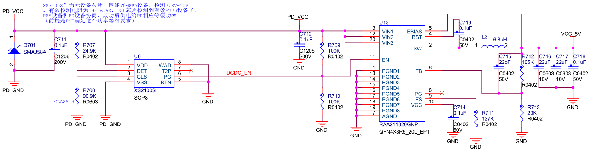
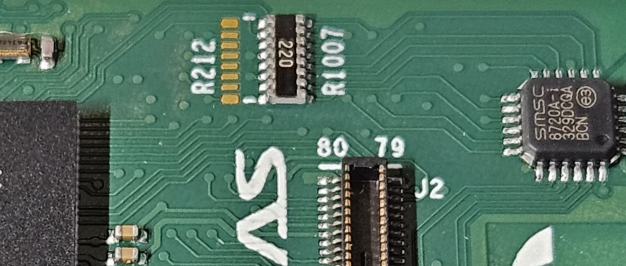

## CPKHMI-RA8D1B的以太网

### RA8 MCU的以太网MAC

RA8D1/M1 MCU带一个支持IEEE802.3x的以太网MAC，支持10/100M以太网。支持MII和RMII接口。在CPKHMI-RA8D1B上，使用RMII接口连接LAN8720AI PHY。

### 以太网供电支持

CPKHMI-RA8D1B作为受电端，通过外置协议芯片XS2100S支持以太网供电。由于核心板及MCU系统的耗电较低，使用了一颗2A的DC-DC（RAA211820）进行降压，得到5V电压。

### 管脚功能复用

以太网MAC接口有两组I/O可供使用，一组与SDRAM接口管脚功能复用，另一组与CEU接口功能复用（此组I/O也与I2S功能复用）。

由于在核心板上已经使用了以太网功能，就会对扩展板上使用CEU接摄像头造成限制。为了在某些情况下可以连接CEU摄像头，在CPKHMI-RA8D1B上做了兼容设计，使用与CEU管脚复用的MAC接口。
- 缺省情况下，I/O作为以太网MAC接口连接LAN8720AI，R1007和R1021贴装。
- 如要使用CEU功能，则需要断开R1007和R1021，并安装R212。
  - P401端口作为MAC功能时，是低速信号MDC，所以可以不用断开R213。
  - P401端口作为CEU功能时，是VIO_D1，速度较快，需要断开R1021，减少影响。
  - P402端口作为MAC功能时，是低速MDIO信号，作为CEU功能时，是GPIO，所以R1022可以一直实装，不会影响信号质量。

R212和R1007使用2选一贴装封装，只能安装其中一个。

[返回目录](01_overview.md)             [下一篇：CPKHMI-RA8D1B的MIPI-DSI接口](11_mipidsi.md)     