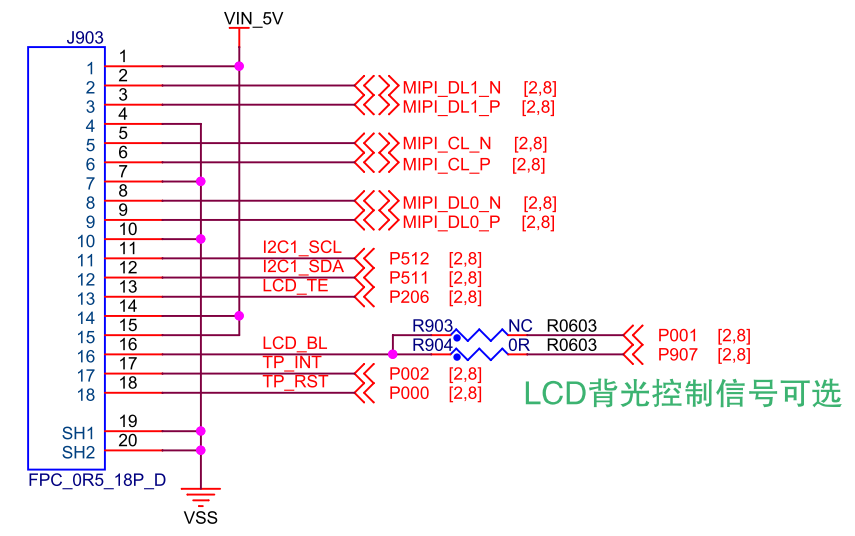

## CPKHMI-RA8D1B的MIPI-DSI接口

### RA8D1B MCU的MIPI显示接口

RA8D1 MCU有两个版本，RA8D1A只支持数字RGB接口，RA8D1B则可以支持数字RGB和MIPI-DSI接口。CPKHMI-RA8D1B用的是支持MIPI-DSI的MCU。

RA8D1B的MIPI-DSI支持两个Lane，每个Lane的最大带宽是720Mbps，总计支持1440Mbps带宽。在RGB888输出格式下，可以支持1280x800 50Hz左右的输出（输出刷新率限制主要是LCDC Pixel Clock的54M限制，而非MIPI-DSI数据带宽）。

### CPKHMI-RA8D1B的MIPI-DSI接口

在核心板上，使用了一个18脚的FPC接口来输出MIPI信号，并支持触摸屏和背光控制，RESET信号。其中背光控制有两个I/O可选，主要是考虑到使用扩展板时可能会有功能冲突。

MIPI-DSI接口上只提供了5V电源，这也是考虑到外接屏幕的多样性，无法同时满足所有屏幕的需求。5V输出可以满足大部分屏幕背光的要求，且电流可以较小。连接特定的LCD屏时，一般都需要做一个简单的转接板，进行接口转换，必要时需要在转接板上做电源转换，或背光控制。

CPKHMI-RA8D1B已经支持野火电子的两个LCD屏，分别是：
 
- 7寸MIPI屏，电容触摸，分辨率1024*600 。
  - 购买链接：https://detail.tmall.com/item.htm?abbucket=12&id=730278908020
- 10.1寸MIPI屏，电容触摸，分辨率800*1280 。
  - 购买链接：https://detail.tmall.com/item.htm?abbucket=12&id=738109826319 

瑞萨和野火电子提供针对这两块屏的转接板设计文件，本仓库中的样例代码中已经提供了针对这两块屏的LCDC初始化和MIPI设置，可以直接使用。

[返回目录](01_overview.md) 