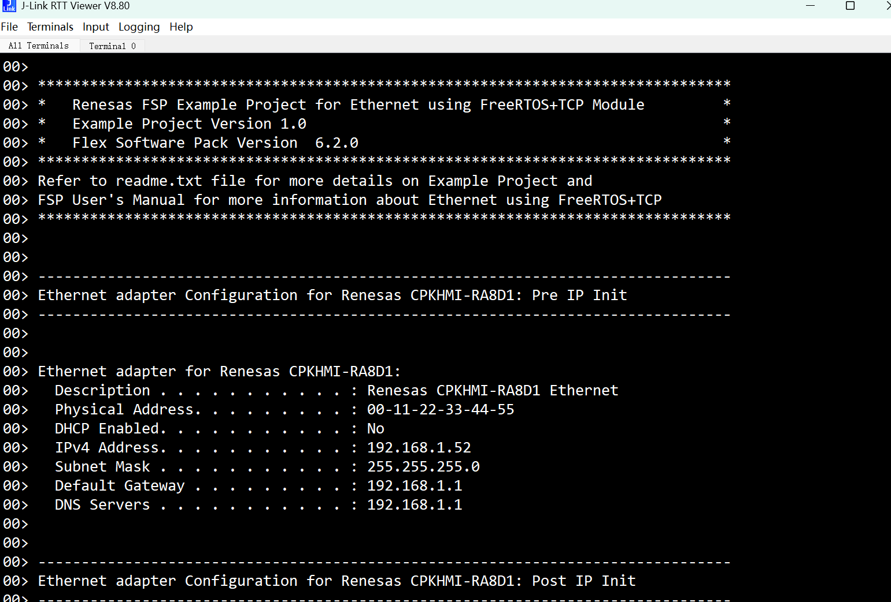
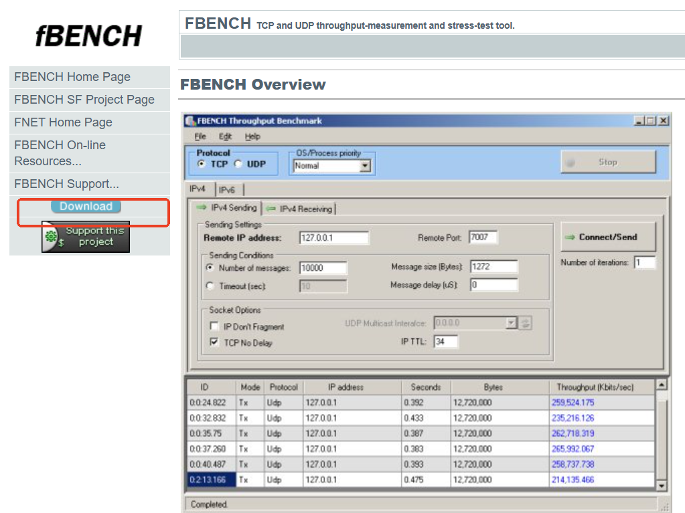
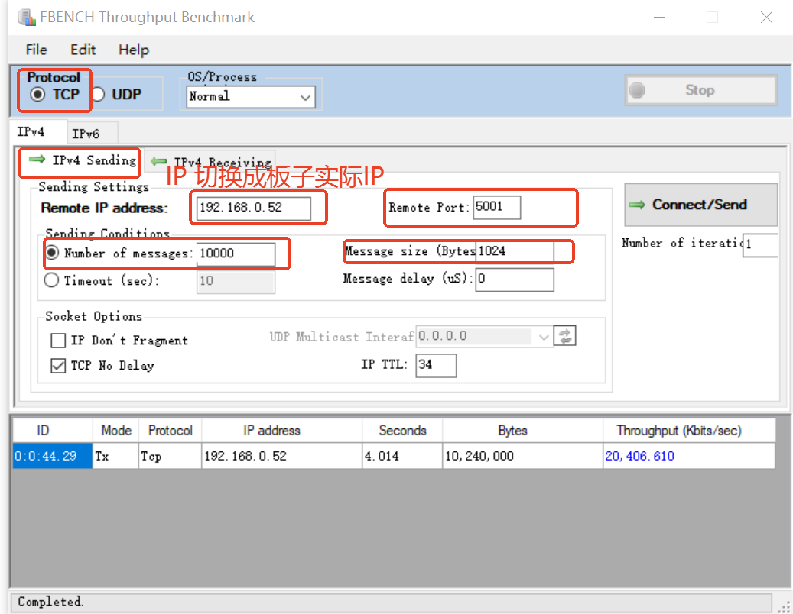
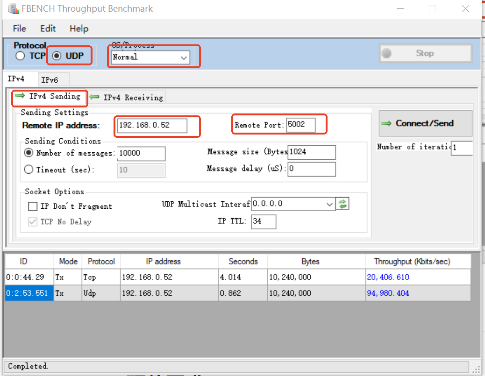

## 1.参考例程概述
该示例项目演示CPKHMI-RA8D1B的FreeRTOS + TCP网络通信程序，它包括DHCP client,DNS cleint和ICMP部分例子。

### 1.1 打开工程
### 1.2 可以根据下面的参数来配置DHCP功能,支持静态地址和动态地址分配
```
|-----------------------------------------------------------------------------------------|
|FreeRTOS+TCP                                   Static IP       Dynamic IP                |
|=========================================================================================|
|Use DHCP	                                Disable         Enable                    |
|-----------------------------------------------------------------------------------------|
|DHCP Register Hostname	                        Disable         Enable                    |
|-----------------------------------------------------------------------------------------|
|DHCP Uses Unicast	                        Disable         Enable                    |
|-----------------------------------------------------------------------------------------|
|DHCP Send Discover After Auto IP	        Disable         Enable                    |
|-----------------------------------------------------------------------------------------|
|DHCP callback function	                        Disable         Enable                    |
|-----------------------------------------------------------------------------------------
```

### 1.3 通过网线连接CPKHMI-RA8D1B网口和路由器，如下：


### 1.4 编译，下载，运行

### 1.5 使用RTT-viewer查看调试信息



## 2. TCP/UDP性能测试

本测试用例默认会启动一个TCP server和一个UDP server，可以利用这两个Server进行一些TCP/UDP相关的性能测试。其中TCP服务器的端口为5001，UDP服务器的端口为5002，请按照以下步骤进行TCP及UDP相关测试

### 2.1. 安装windows tcp/udp测试软件

windows上我们可以使用fbench这个工具来进行tcp/udp的性能测试，fbench工具的下载地址为：

https://fbench.sourceforge.net/

根据提示下载对应安装包，安装即可。



### 2.2 fbench TCP测试

请按照以下设置进行TCP测试，注意IP地址需要换成板子实际IP。



### 2.2 fbench UDP测试

请按照以下设置进行UDP测试，注意IP地址需要换成板子实际IP。



## 3. 支持的电路板：
CPKHMI-RA8D1B

## 4. 硬件要求：
1块瑞萨 RA8D1 HMI板：CPKHMI-RA8D1B

1根 Type-C USB 数据线

1根 网线

1个 路由器

## 5. 硬件连接：
通过Type-C USB 数据线将 CPKHMI-RA8D1B板上的 USB 调试端口（JDBG）连接到主机 PC
连接网线到板子