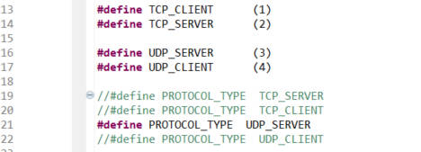
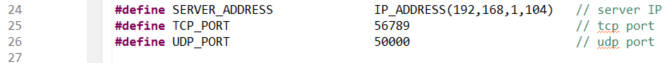
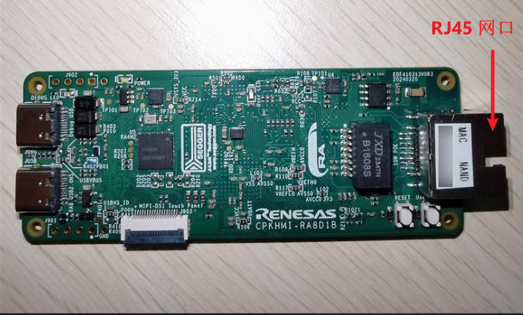
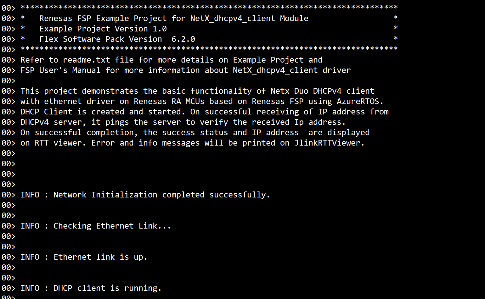

## 1.参考例程概述
该示例工程演示了基于CPKHMI-RA8D1B的Threadx Netx Duo的网络通信程序，它包括DHCPv4 client部分和TCP/UDP 服务器/客户端例子。

### 1.1 打开工程
### 1.2 可以根据下面的宏参数来选择TCP/UDP服务器/客户端相关代码和IP,端口设置

### 1.3 通过网线连接CPKHMI-RA8D1B网口和路由器，如下：

### 1.4 编译，下载，运行

### 1.5 使用RTT-viewer查看调试信息

## 2. 支持的电路板：
CPKHMI-RA8D1B

## 3. 硬件要求：
1块瑞萨 RA8D1 HMI板：CPKHMI-RA8D1B

1根 Type-C USB 数据线

1根 网线

1个 路由器

## 4. 硬件连接：
通过Type-C USB 数据线将 CPKHMI-RA8D1B板上的 USB 调试端口（JDBG）连接到主机 PC
连接网线到板子