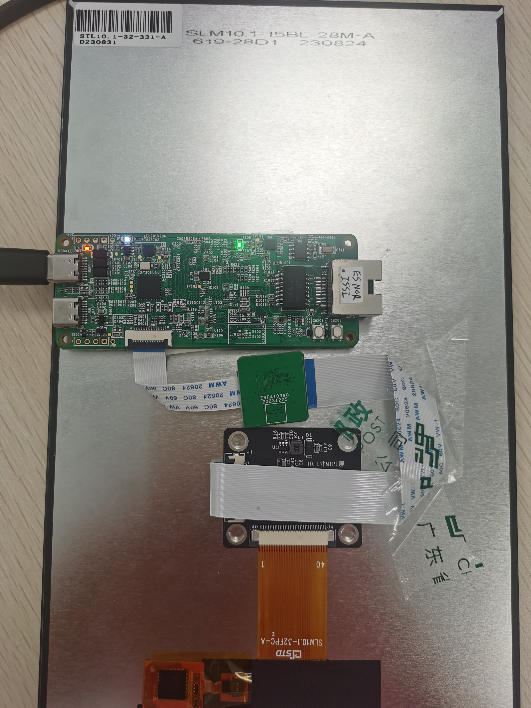

## 1.参考例程概述
该示例项目演示了基于瑞萨 RA8D1+MIPI 显示LVGL V8 的 HMI 功能

### 1.1 打开工程
### 1.2 可以打开 /src 下的 lv_conf.h 对 LVGL V8 进行配置，比如 LVGL 官网的 demo usage 配置：
```
/*===================
 * DEMO USAGE
 ====================*/

/*Show some widget. It might be required to increase `LV_MEM_SIZE` */
#define LV_USE_DEMO_WIDGETS 1//0
#if LV_USE_DEMO_WIDGETS
    #define LV_DEMO_WIDGETS_SLIDESHOW 0
#endif

/*Demonstrate the usage of encoder and keyboard*/
#define LV_USE_DEMO_KEYPAD_AND_ENCODER 0

/*Benchmark your system*/
#define LV_USE_DEMO_BENCHMARK 0
#if LV_USE_DEMO_BENCHMARK
    /*Use RGB565A8 images with 16 bit color depth instead of ARGB8565*/
    #define LV_DEMO_BENCHMARK_RGB565A8 0
#endif

/*Stress test for LVGL*/
#define LV_USE_DEMO_STRESS 0

/*Music player demo*/
#define LV_USE_DEMO_MUSIC 0//1
```

### 1.3 连接屏幕，如下：



### 1.4 编译，下载，运行


## 2. 如果需要使用 7 寸屏，可以参考 mipi_cpkhmi_ra8d1_ep 的配置

### 2.1 最后显示如下


## 3. 支持的电路板：
CPKHMI-RA8D1B

## 4. 硬件要求：
1块瑞萨 RA8D1 HMI板：CPKHMI-RA8D1B

1根 Type-C USB 数据线

1块 10.1inch 屏，或者 7inch 屏

## 5. 硬件连接：
通过Type-C USB 数据线将 CPKHMI-RA8D1B板上的 USB 调试端口（JDBG）连接到主机 PC
连接屏幕到板子