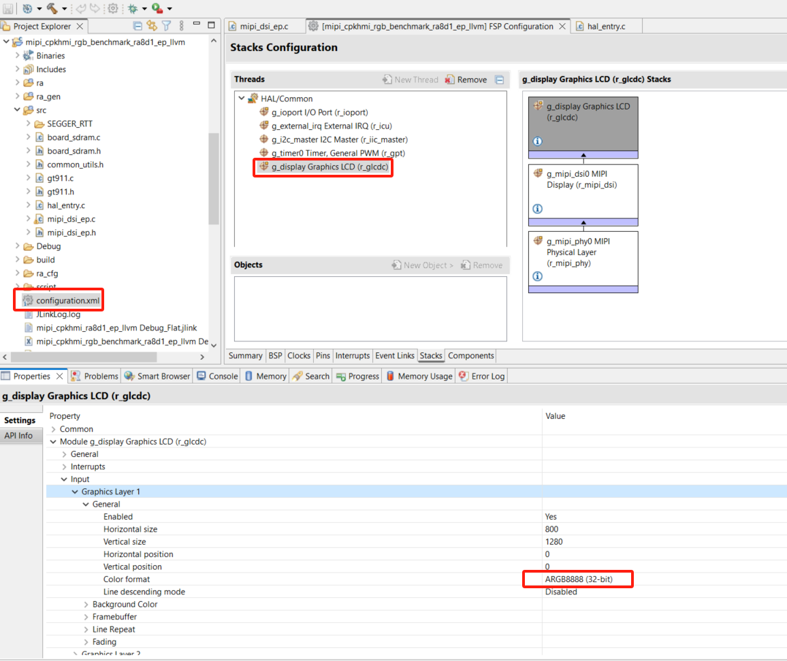
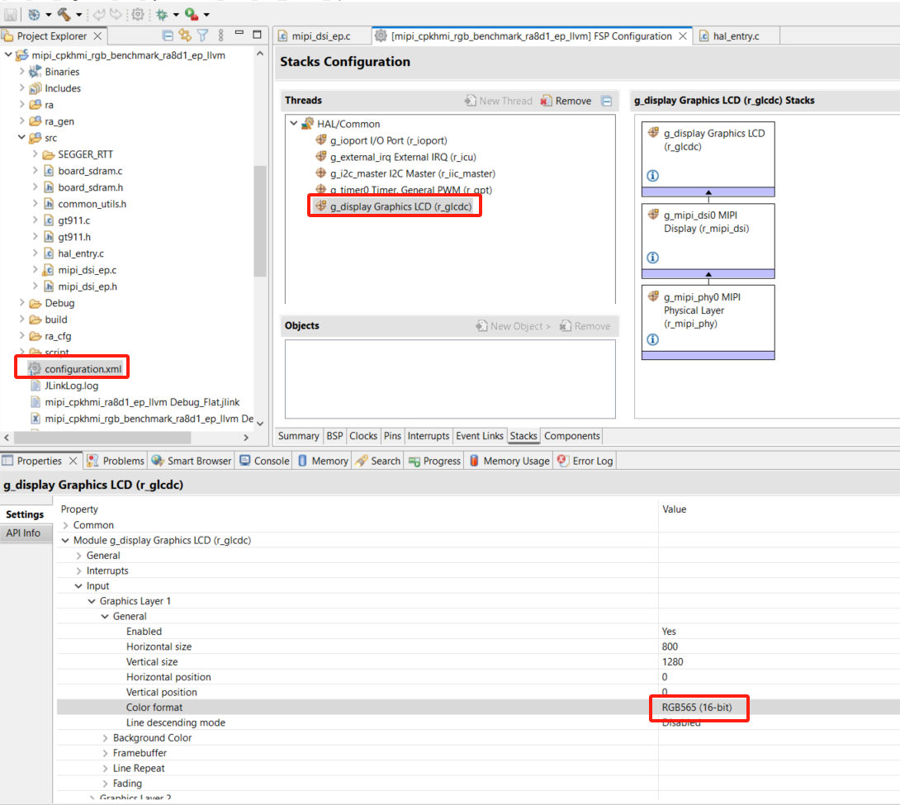
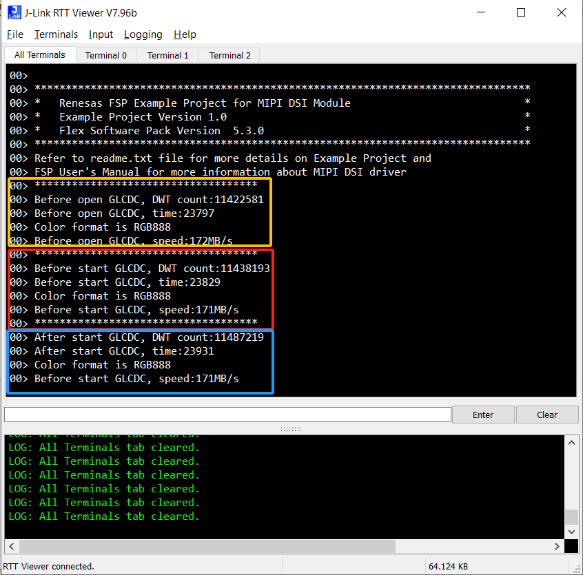
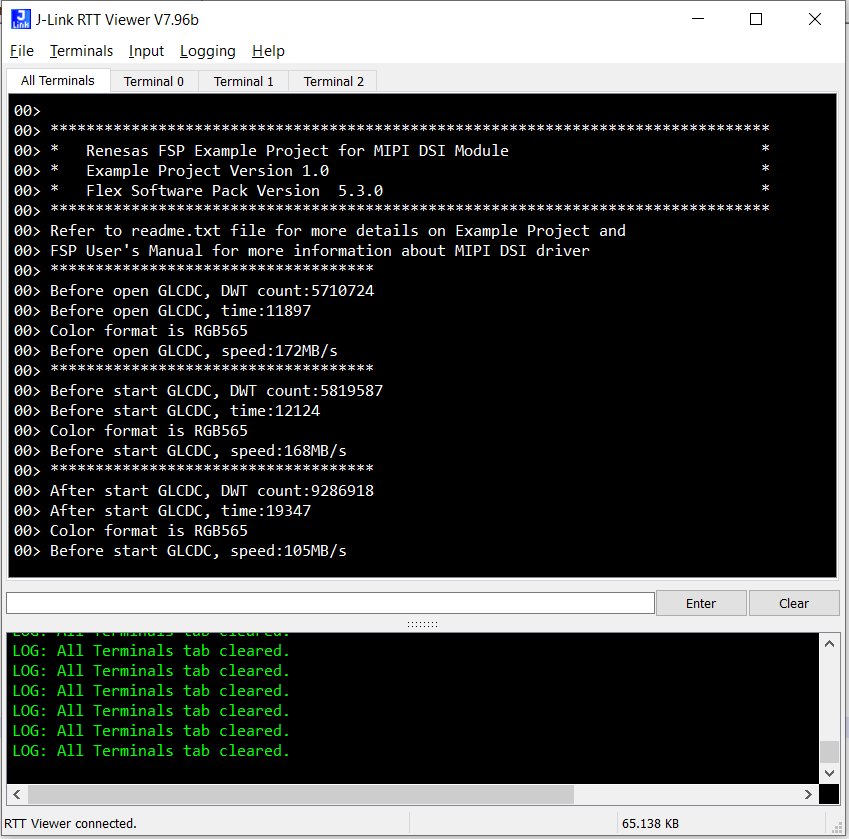

## 1.参考例程概述
该示例项目演示了基于瑞萨 RA8D1 MIPI 驱动的功能，并对显示性能进行测试。分别在执行 open glcdc 前后，和 start glcdc 前后对 SDRAM 性能测试。包含RGB565和RGB888/ARGB8888格式颜色的测试。

### 1.1 打开工程
### 1.2 可以使用这三个参数显示不同的颜色 pattern
```
typedef enum
{
    simple = 0, 
    partition = 1,
    gradient = 2
} color_pattern_t;
```


### 1.3 连接屏幕，如下：


### 1.4 编译，下载，运行


## 2. 修改参数，适配 7inch 屏（工程默认是10inch 1280*800的配置）

### 2.1 修改 mipi_dsi_ep.c 第 204 行的代码，改成 0 ，将配置 7inch 的参数


### 2.2 修改 FSP 中 glcdc stack 中的参数，具体要改分辨率大小，以及 glcdc 的 timing。这里列出 7inch 和 10inch 的配置，大家自行参考

7inch:


10.1inch:


## 3. 修改颜色格式
### 3.1 打开GLCDC stack



如果要测试RGB565，修改如下：



修改后点击右上角 Generate Project Content 生成代码，然后编译，烧录


## 4. 查看输出结果
### 4.1 打开 RTT，选择对应的MCU，连接，并复位MCU。得到以下结果：



测试RGB565结果如下：



## 3. 支持的电路板：
CPKHMI-RA8D1B

## 4. 硬件要求：
1块瑞萨 RA8D1 HMI板：CPKHMI-RA8D1B

1根 Type-C USB 数据线

1块 10.1inch 屏，或者 7inch 屏

## 5. 硬件连接：
通过Type-C USB 数据线将 CPKHMI-RA8D1B板上的 USB 调试端口（JDBG）连接到主机 PC
连接屏幕到板子