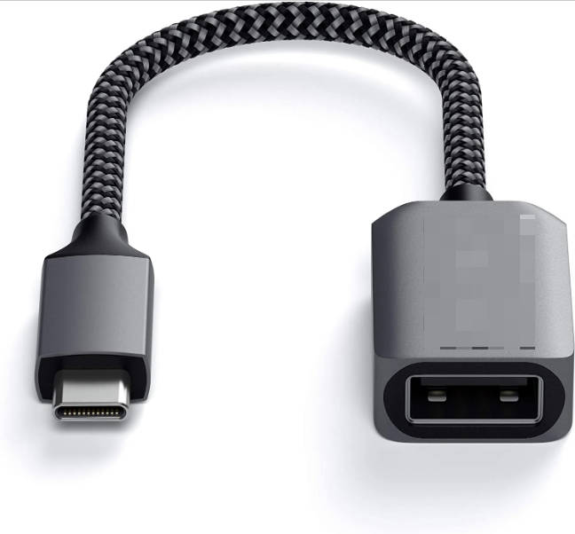

该示例工程由 瑞萨电子-凌滔 提供，2024年11月29日

#### 工程概述:
该工程是使用瑞萨CPK-RA8HMI实现USBX UVC和MJPG Streamer的例子。

#### 支持的开发板 / 演示板：
CPKHMI-RA8D1B

#### 硬件要求：
* 1块 Renesas RA8开发板：CPKHMI-RA8D1B
* 1根 USB Type A->Type C 或 Type-C->Type C 线 （支持 Type-C 2.0 即可）
* 1根 USB C to USB TYPE A(母头) 线
  
  
* 1根 网线
* 1个 路由器
* 1个 Webcam
  本代码使用的USB Camera型号为[logitech c505e](https://www.logitech.com/en-us/products/webcams/c505e-business-webcam.html)

#### 硬件连接：
* 通过 USB Type-C 线连接调试主机和 CPKCOR-RA8D1B 板上的 USB 调试端口。
* 通过 USB Type C->Type A（母头）连接USB Camera与CPKCOR-RA8D1B 板上的JUSB端口。
* 通过网线连接CPKHMI-RA8D1B的网口与路由器。

#### 硬件设置注意事项：
- 无

### 软件开发环境：
   
* FSP版本
  * FSP 5.3.0
* 集成开发环境和编译器：
  * e2studio v2024-04 + LLVM for ARM 17.0.1
  
#### 第三方软件
  * Windows 10 edge 浏览器
  * [Segger J-Link RTT Viewer](https://www.segger.com/downloads/jlink/) V7.92o以上

#### 操作步骤：
* 打开工程
* 编译，烧录
* 打开RTT-Viewer查看调试信息
* 打开浏览器，输入CPKCOR-RA8D1B的IP打头的网址，如192.168.3.3/?RA8=mjpeg，开启mjpg streamer。

### 详细的样例程序配置和使用，请参考下面的文件。
[mjpg_streamer_cpkhmi_ra8d1b_ep_readme](mjpg_streamer_cpkhmi_ra8d1b_ep_readme.md)