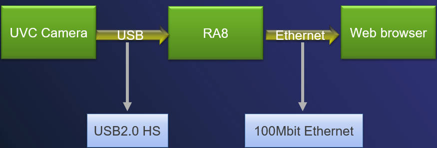
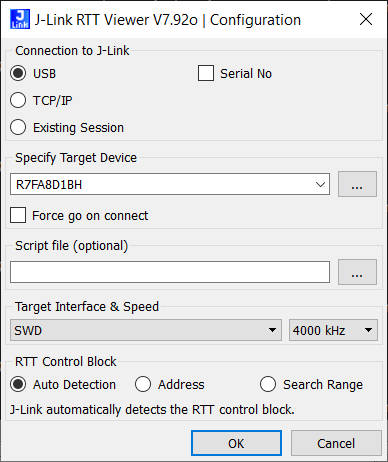
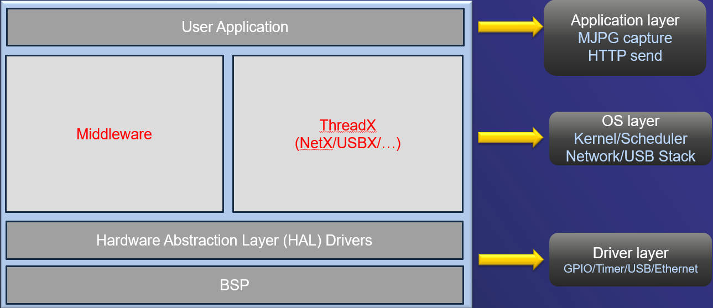
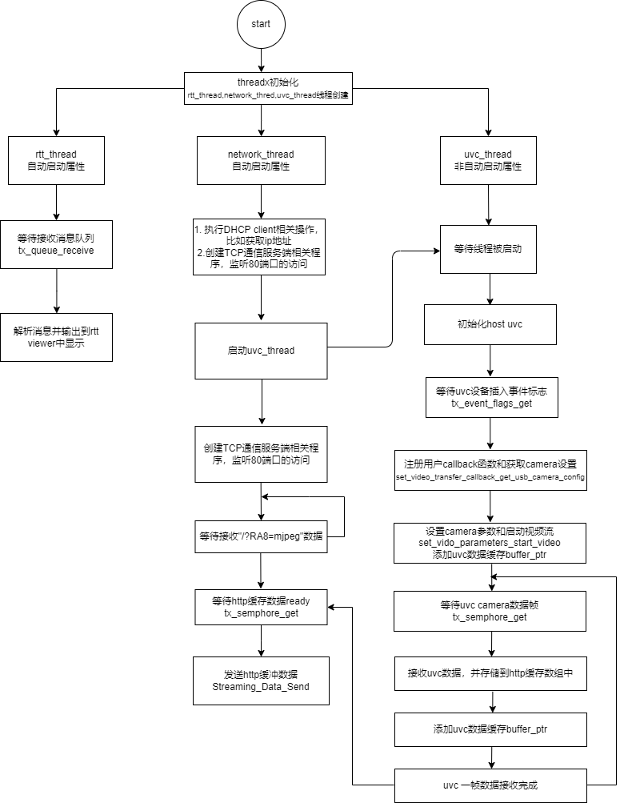
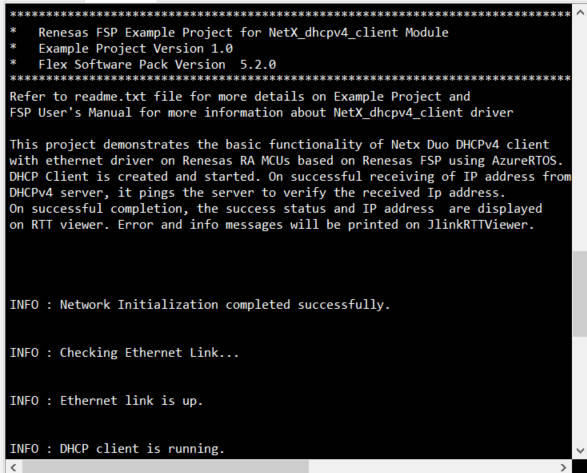
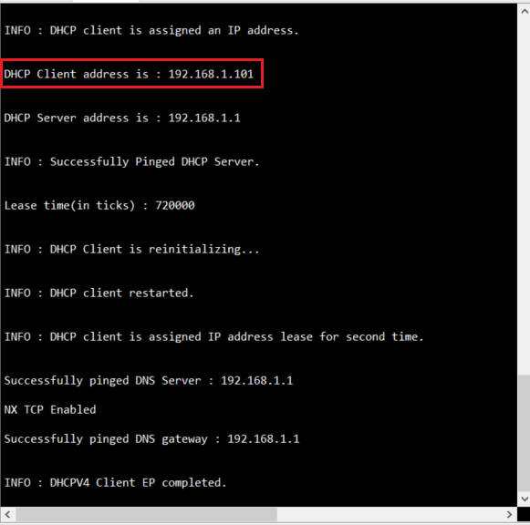
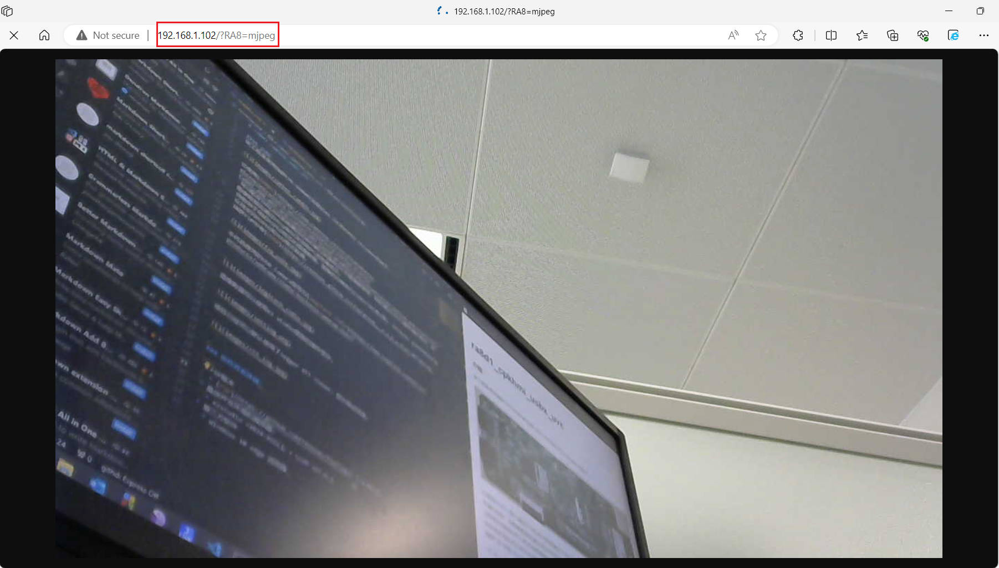

## 1.参考例程概述
该工程是使用ARM Cortex M85内核的[RA8D1](https://www.renesas.cn/cn/zh/products/microcontrollers-microprocessors/ra-cortex-m-mcus/ra8d1-480-mhz-arm-cortex-m85-based-graphics-microcontroller-helium-and-trustzone) MCU配合[THREADX](https://github.com/eclipse-threadx/threadx)系统通过USBHS接口来接收UVC中MJPG图像数据流，同时以http服务器的身份，将MJPG图像数据流通过http协议发送给PC浏览器显示。

系统框图如下：

项目已经可以默认使用了Segger RTT viewer，显示调试信息。

## 软件框架图

## 代码流程图

### 1.1 创建新工程，BSP选择“CPK-RA8D1B Core Board”，RTOS选择 Azure RTOS Threadx。
### 1.2 参考例程中的设置，在Stack中依次创建和添加Thread,Azure RTOS NetX Duo DHCP IPv4 Client, Azure RTOS USBX HUVC等内容。
### 1.3 编译工程，并开启调试。
### 1.4 在e2 studio中调试代码，代码自由运行。打开RTT Viewer，可以看到如下Log打印，显示当前CPK-RA8HMI正在运行DHCP,等待路由器的IP分配过程。

### 1.5 CPK-RA8HMI获取到IP地址成功，RTT_Viewer中会显示获取到的IP地址。根据自己的实际情况

### 1.６ 根据自己的实际情况，在浏览器中输入CPK-RA8HMI访问地址。如本例中，CPK-RA8HMI的IP地址是192.168.1.101。所以输入192.168.1.101/?RA8=mjpeg。

