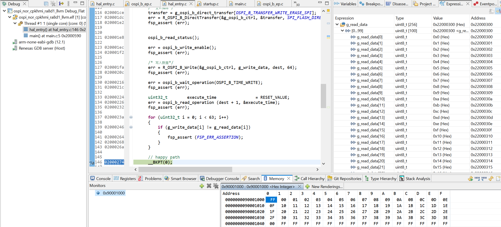

## 1.参考例程概述
该示例项目演示了基于瑞萨 FSP 的瑞萨 RA MCU 上 OSPI_B 驱动程序的基本功能。

### 1.1 创建新工程，BSP选择“CPKHMI-RA8D1B + Octa-Flash”
### 1.2 Stack中添加“OSPI Flash (r_ospi_b)”，详细的属性设置请参考例程

### 1.3 具体操作：
#### 1.3.1 用户选择 opsi_b 模块的模式：SPI 1S-1S-1S 协议模式。
#### 1.3.2 读取 NOR Flash的 Device ID 信息。
#### 1.3.3 写 NOR Flash中寄存器，修改地址宽度为 4，并查看地址宽度最低位和通信模式。
#### 1.3.4 擦除整片 NOR FLASH。
#### 1.3.5 将数据写入 NOR FLASH。
#### 1.3.6 从 NOR FLASH读回数据，并进行比较，确认写入成功。也可以从Memory窗口看到写入的数据。

## 2. 支持的电路板：
CPKHMI-RA8D1B（NOR Flash）

## 3. 硬件要求：
1块瑞萨 RA HMI板：CPKHMI-RA8D1B（NOR Flash）

1根Type-C USB 数据线

## 4. 硬件连接：
通过Type-C USB 数据线将 CPKHMI-RA8D1B板上的 USB 调试端口（JDBG）连接到主机 PC。

