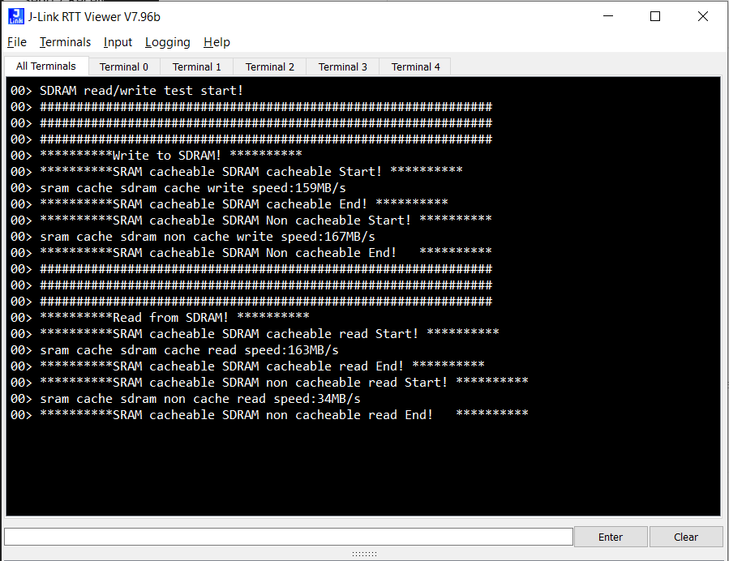

## 1.参考例程概述
该示例项目演示了基于瑞萨 RA8D1 MIPI 驱动以及 SDRAM 性能测试的功能，本工程通过DWT counter计算读写SDRAM的时间，并通过J-Link RTT打印输出对应的结果。

### 1.1 打开工程

### 1.2 编译，下载，运行

## 2. 结果分析

### 2.1 代码中通过把SRAM数据写到SDRAM，和从SDRAM把数据读到SRAM，其中考虑开D-Cache的影响。分别测出对应的SDRAM的读写速度。从数据中我们可以看到在写SDRAM时，
把SRAM cacheable的数据写到SDRAM，SDRAM在 non-cacheable时，速度是最快的。所以如果需要写SDRAM时，最好是enable D-Cache，并且把目标SDRAM的buffer放到.noncache_sdram 这个 section

## 4. 支持的电路板：
CPKHMI-RA8D1B

## 5. 硬件要求：
1块瑞萨 RA8D1 HMI板：CPKHMI-RA8D1B

1根 Type-C USB 数据线

## 6. 硬件连接：
通过Type-C USB 数据线将 CPKHMI-RA8D1B板上的 USB 调试端口（JDBG）连接到主机 PC
连接屏幕到板子