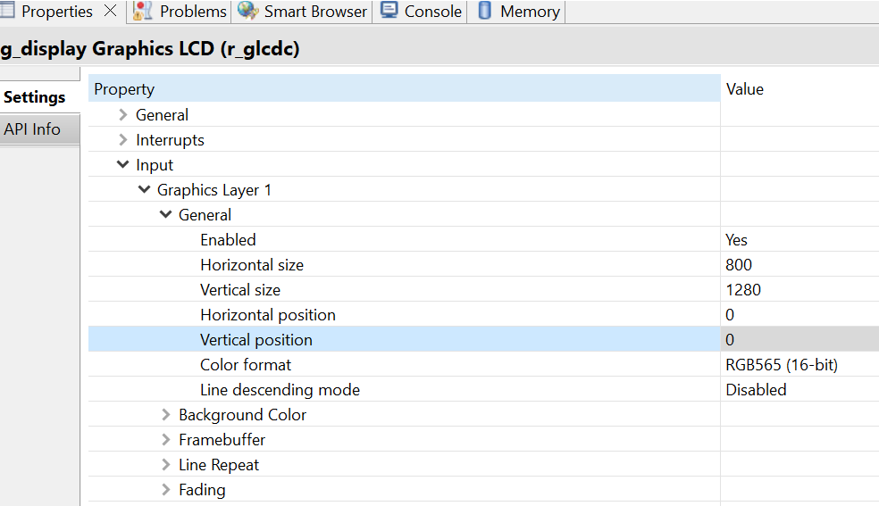

## 1.参考例程概述
该示例项目演示了基于瑞萨 RA8D1 MIPI 驱动以及 SDRAM 性能测试的功能，本工程通过DWT counter计算写SDRAM的时间，分别测试了在支持 GLCDC start 前后的时间对比。

显示数据格式为RGB565，16位色深。

### 1.1 打开工程

### 1.3 连接屏幕，如下：

### 1.4 编译，下载，运行

## 2. 如果需要使用 7inch 屏，修改参数，适配 7inch 屏

### 2.1 修改 mipi_dsi_ep.c 第 204 行的代码，改成 0 ，将配置 7inch 的参数

### 2.2 修改 FSP 中 glcdc stack 中的参数，具体要改分辨率大小，以及 glcdc 的 timing。这里列出 7inch 和 10inch 的配置，大家自行参考

7inch:

10.1inch:

## 3. 运行成功后，用Jlink-RTT viewer可以看到以下log：

## 4. 支持的电路板：
CPKHMI-RA8D1B

## 5. 硬件要求：
1块瑞萨 RA8D1 HMI板：CPKHMI-RA8D1B

1根 Type-C USB 数据线

1块 10.1inch 屏，或者 7inch 屏

## 6. 硬件连接：
通过Type-C USB 数据线将 CPKHMI-RA8D1B板上的 USB 调试端口（JDBG）连接到主机 PC
连接屏幕到板子