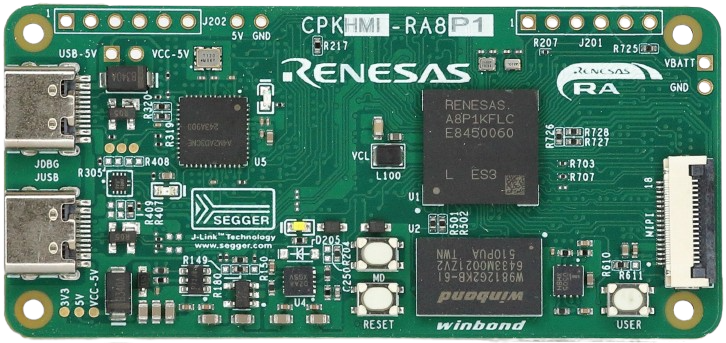

:scripts: cjk

== CPKHMI-RA8P1核心板

本目录下仅存放可以在 CPKHMI-RA8P1 核心板上直接运行的的样例代码和该核心板的link:../cpkhmi_ra8p1/docs/01_overview.adoc[使用手册]。

如果您需要查看RA8P1 MCU在缺省扩展板上运行的样例代码及文档，请参考 link:../cpk_ra8p1/[CPK-RA8P1]。

如果您需要使用本核心板配合其他扩展板，请参考本代码仓库下对应的目录（cpkhmi_ra8p1_扩展板名称）。

每个样例程序目录下都准备了对应压缩包供下载，如果您没有同步代码库的需求，可以直接下载ZIP包使用。

各个样例程序所需的软硬件配置请查看对应样例程序目录下的Readme文件。

. link:../cpkhmi_ra8p1/perf_counter_cpkhmi_ra8p1_ep/[在CPKHMI-RA8P1上使用 perf_counter 进行性能测试]
. link:../cpkhmi_ra8p1/memconfig_benchmark_cpkhmi_ra8p1_ep/[RA8P1程序/数据存储位置对性能的影响评测样例]
. link:../cpkhmi_ra8p1/blinky_benchmark_tutorial_cpkhmi_ra8p1_ep/[RA8P1 如何在用户工程中添加性能评估测试代码]
. link:../cpkhmi_ra8p1/qspi_cpkhmi_ra8p1_ep/[RA8P1 QSPI NOR-Flash 样例程序]

Ver. 20260131