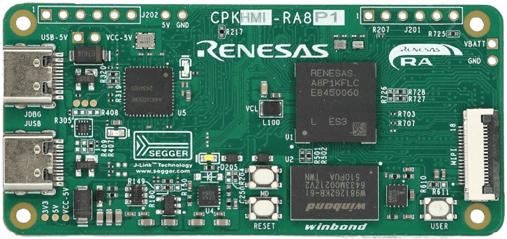

:scripts: cjk

== CPKHMI-RA8P1核心板

本目录下仅存放可以在 CPKHMI-RA8P1 核心板上直接运行的的样例代码和该核心板的link:../cpkhmi_ra8p1/docs/01_overview.adoc[使用手册]。

如果您需要查看本核心板搭配缺省扩展板的样例代码及文档，请参考 link:../cpkmini_ra8p1/[CPKMINI-RA8P1]。

如果您需要使用本核心板配合其他扩展板，请参考本代码仓库下对应的目录（cpkhmi_ra8p1_扩展板名称）。

本核心板的部分样例代码可以在修改后用于其他开发板，详见样例程序的Readme文件。

各个样例程序所需的软硬件配置请查看对应样例程序目录下的Readme文件。

每个样例程序都准备了对应压缩包供下载，如果您没有同步代码库的需求，可以直接下载ZIP包使用。

. link:../cpkhmi_ra8p1/perf_counter_cpkhmi_ra8p1_ep/[RA8P1基于perf_counter的CoreMark基准测试程序] - link:../cpkhmi_ra8p1/_ep_archive/perf_counter_cpkhmi_ra8p1_ep_rafsp6.4.0.zip[下载ZIP包]
. link:../cpkhmi_ra8p1/memconfig_benchmark_cpkhmi_ra8p1_ep/[RA8P1在不同的存储配置下使用CoreMark进行性能测试] - link:../cpkhmi_ra8p1/_ep_archive/memconfig_benchmark_cpkhmi_ra8p1_ep_rafsp6.4.0.zip[下载ZIP包]
. link:../cpkhmi_ra8p1/blinky_benchmark_tutorial_cpkhmi_ra8p1_ep/[基于Blinky程序，添加perf_counter和串口通信程序，实现基础程序框架] - link:../cpkhmi_ra8p1/_ep_archive/blinky_benchmark_tutorial_cpkhmi_ra8p1_ep_rafsp6.4.0.zip[下载ZIP包]
. link:../cpkhmi_ra8p1/ek79007_lcd_mipi_cpkhmi_ra8p1_ep/[RA8P1 MIPI-DSI 驱动 EK79007 屏幕 1024 x 600] - link:../cpkhmi_ra8p1/_ep_archive/ek79007_lcd_mipi_cpkhmi_ra8p1_ep_rafsp6.4.0.zip[下载ZIP包]
. link:../cpkhmi_ra8p1/ili9881c_lcd_mipi_cpkhmi_ra8p1_ep/[RA8P1 MIPI-DSI 驱动 ILI9881C 屏幕 800 x 1280] - link:../cpkhmi_ra8p1/_ep_archive/ili9881c_lcd_mipi_cpkhmi_ra8p1_ep_rafsp6.4.0.zip[下载ZIP包]
. link:../cpkhmi_ra8p1/fusb303b_cpkhmi_ra8p1_ep/[RA8P1使用 FUSB303B 识别和控制 USB Type-C的Source 和 Sink 角色] - link:../cpkhmi_ra8p1/_ep_archive/fusb303b_cpkhmi_ra8p1_ep_rafsp6.4.0.zip[下载ZIP包]
. link:../cpkhmi_ra8p1/sdram_cpkhmi_ra8p1_ep/[RA8P1驱动32位SDRAM] - link:../cpkhmi_ra8p1/_ep_archive/sdram_cpkhmi_ra8p1_ep_rafsp6.4.0.zip[下载ZIP包]
. link:../cpkhmi_ra8p1/qspi_flash_cpkhmi_ra8p1_ep/[RA8P1驱动QSPI Flash] - link:../cpkhmi_ra8p1/_ep_archive/qspi_flash_cpkhmi_ra8p1_ep_rafsp6.4.0.zip[下载ZIP包]

以下样例程序只与MCU本身相关，或开发板硬件配置一致，修改设置后即可在此核心板上运行：

. link:../cpkcor_ra8t2/microsd_basic_rw_cpkcor_ra8t2_ep/[RA8T2对 MicroSD 卡进行无文件系统的基本读写] - link:../cpkcor_ra8t2/_ep_archive/microsd_basic_rw_cpkcor_ra8t2_ep_rafsp6.4.0.zip[下载ZIP包]
. link:../cpkcor_ra8p1/usbhs_pcdc_cpkcor_ra8p1_ep/[RA8P1使用 USB-HS PCDC 同上位机进行通信] - link:../cpkcor_ra8p1/_ep_archive/usbhs_pcdc_cpkcor_ra8p1_ep_rafsp6.4.0.zip[下载ZIP包]
. link:../cpkcor_ra8p1/usbhs_pcdc_console_cpkcor_ra8p1_ep/[RA8P1将 C stdio 重定向到 USB-HS PCDC] - link:../cpkcor_ra8p1/_ep_archive/usbhs_pcdc_console_cpkcor_ra8p1_ep_rafsp6.4.0.zip[下载ZIP包]
. link:../cpknet_ra8t2/acmphs_cpknet_ra8t2_ep/[RA8P1/x2 MCU的ACMPHS 驱动程序的基本功能] - link:../cpknet_ra8t2/_ep_archive/acmphs_cpknet_ra8t2_ep_rafsp6.5.0.zip[下载ZIP包]
. link:../cpknet_ra8t2/adc_continues_scan_cpknet_ra8t2_ep/[RA8P1/x2 MCU 的ADC16H（ADC_B）连续扫描驱动程序的基本功能] - link:../cpknet_ra8t2/_ep_archive/adc_continues_scan_cpknet_ra8t2_ep_rafsp6.5.0.zip[下载ZIP包]
. link:../cpknet_ra8t2/adc_singlescan_cpknet_ra8t2_ep/[RA8P1/x2 MCU的ADC16H（ADC_B）单次扫描驱动程序的基本功能] - link:../cpknet_ra8t2/_ep_archive/adc_singlescan_cpknet_ra8t2_ep_rafsp6.5.0.zip[下载ZIP包]
. link:../cpknet_ra8t2/agt_cpknet_ra8t2_ep/[RA8P1/x2 MCU的 AGT 驱动程序的基本功能] - link:../cpknet_ra8t2/_ep_archive/agt_cpknet_ra8t2_ep_rafsp6.5.0.zip[下载ZIP包]
. link:../cpknet_ra8t2/cac_cpknet_ra8t2_ep/[RA8P1/x2 MCU的CAC 驱动程序的基本功能] - link:../cpknet_ra8t2/_ep_archive/cac_cpknet_ra8t2_ep_rafsp6.5.0.zip[下载ZIP包]
. link:../cpknet_ra8t2/crc_cpknet_ra8t2_ep/[RA8P1/x2 MCU的CRC 驱动程序的基本功能] - link:../cpknet_ra8t2/_ep_archive/crc_cpknet_ra8t2_ep_rafsp6.5.0.zip[下载ZIP包]
. link:../cpknet_ra8t2/dac_cpknet_ra8t2_ep/[RA8P1/x2 MCU的DAC12（DAC_B）驱动程序的基本功能] - link:../cpknet_ra8t2/_ep_archive/dac_cpknet_ra8t2_ep_rafsp6.5.0.zip[下载ZIP包]
. link:../cpknet_ra8t2/dma_block_cpknet_ra8t2_ep/[RA8P1/x2 MCU的DMAC驱动程序的基本功能-块传输] - link:../cpknet_ra8t2/_ep_archive/dma_block_cpknet_ra8t2_ep_rafsp6.5.0.zip[下载ZIP包]
. link:../cpknet_ra8t2/dma_normal_cpknet_ra8t2_ep/[RA8P1/x2 MCU的DMAC驱动程序的基本功能-普通传输模式] - link:../cpknet_ra8t2/_ep_archive/dma_normal_cpknet_ra8t2_ep_rafsp6.5.0.zip[下载ZIP包]
. link:../cpknet_ra8t2/dma_repeat_cpknet_ra8t2_ep/[RA8P1/x2 MCU的DMAC驱动程序的基本功能-重复模式] - link:../cpknet_ra8t2/_ep_archive/dma_repeat_cpknet_ra8t2_ep_rafsp6.5.0.zip[下载ZIP包]
. link:../cpknet_ra8t2/dma_repeatblock_cpknet_ra8t2_ep/[RA8P1/x2 MCU的DMAC驱动程序的基本功能-重复模式块传输] - link:../cpknet_ra8t2/_ep_archive/dma_repeatblock_cpknet_ra8t2_ep_rafsp6.5.0.zip[下载ZIP包]
. link:../cpknet_ra8t2/doc_cpknet_ra8t2_ep/[RA8P1/x2 MCU的Data operation circuit(DOC) 驱动程序的基本功能] - link:../cpknet_ra8t2/_ep_archive/doc_cpknet_ra8t2_ep_rafsp6.5.0.zip[下载ZIP包]
. link:../cpknet_ra8t2/elc_cpknet_ra8t2_ep/[RA8P1/x2 MCU的ELC驱动程序的基本功能] - link:../cpknet_ra8t2/_ep_archive/elc_cpknet_ra8t2_ep_rafsp6.5.0.zip[下载ZIP包]
. link:../cpknet_ra8t2/gpt_cpknet_ra8t2_ep/[RA8P1/x2 MCU的GPT驱动程序的基本功能 - 多种定时器工作模式] - link:../cpknet_ra8t2/_ep_archive/gpt_cpknet_ra8t2_ep_rafsp6.5.0.zip[下载ZIP包]
. link:../cpknet_ra8t2/icu_cpknet_ra8t2_ep/[RA8P1/x2 MCU的ICU驱动程序的基本功能] - link:../cpknet_ra8t2/_ep_archive/icu_cpknet_ra8t2_ep_rafsp6.5.0.zip[下载ZIP包]
. link:../cpknet_ra8t2/iwdt_cpknet_ra8t2_ep/[RA8P1/x2 MCU的iwdt驱动程序的基本功能] - link:../cpknet_ra8t2/_ep_archive/iwdt_cpknet_ra8t2_ep_rafsp6.5.0.zip[下载ZIP包]
. link:../cpknet_ra8t2/rtc_cpknet_ra8t2_ep/[RA8P1/x2 MCU的RTC驱动程序的基本功能] - link:../cpknet_ra8t2/_ep_archive/rtc_cpknet_ra8t2_ep_rafsp6.5.0.zip[下载ZIP包]
. link:../cpknet_ra8t2/sci_uart_cpknet_ra8t2_ep/[RA8P1/x2 MCU的SCI-UART驱动程序的基本功能] - link:../cpknet_ra8t2/_ep_archive/sci_uart_cpknet_ra8t2_ep_rafsp6.5.0.zip[下载ZIP包]
. link:../cpknet_ra8t2/ulpt_cpknet_ra8t2_ep/[RA8P1/x2 MCU的ULPT驱动程序的基本功能] - link:../cpknet_ra8t2/_ep_archive/ulpt_cpknet_ra8t2_ep_rafsp6.5.0.zip[下载ZIP包]
. link:../cpknet_ra8t2/wdt_cpknet_ra8t2_ep/[RA8P1/x2 MCU的WDT驱动程序的基本功能] - link:../cpknet_ra8t2/_ep_archive/wdt_cpknet_ra8t2_ep_rafsp6.5.0.zip[下载ZIP包]

以下例程使用的硬件配置和系统设置与本核心板类似，可将将这些例程移植到本核心板上运行：

* 无

Ver. 20260904