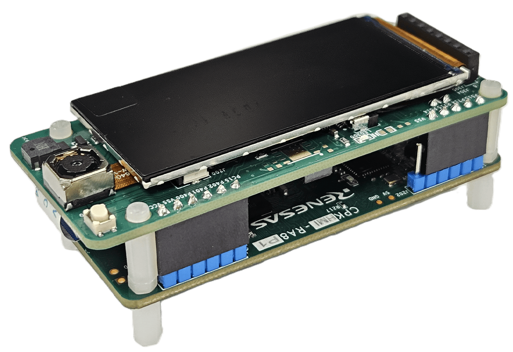

:scripts: cjk

== CPKMINI-RA8P1开发套件

CPKMINI-RA8P1开发套件由核心板CPKHMI-RA8P1 + 扩展板CPKEXP-MINI8x2组合而成，这是设计用于演示，教学和其他用途的简易开发套件。

核心板和扩展板之间通过排针以及 18Pin FPC 线缆连接，在CPKEXP-MINI8x2的包装盒里有所有需要的附件。

本目录下仅存放适用于该开发套件的样例代码和link:../cpkmini_ra8p1/docs/41_overview.adoc[使用手册]。

如果您需要查看可在CPKHMI-RA8P1核心板上独立运行的样例代码及文档，请跳转至 link:../cpkhmi_ra8p1/[CPKHMI-RA8P1]。

如果您需要使用其他核心板配合CPKEXP-MINI8x2扩展板使用，请参考本代码仓库下对应的目录（核心板名称_mini8x2）。本开发套件的部分样例代码可以在修改后用于其他组合，详见样例程序的Readme文件。

各个样例程序所需的软硬件配置也请查看对应样例程序目录下的Readme文件。

. link:../cpkmini_ra8p1/ov5640_mipi_csi_cpkmini_ra8p1_ep/[RA8P1驱动MIPI-CSI接口的OV5640摄像头] - link:../cpkmini_ra8p1/_ep_archive/ov5640_mipi_csi_cpkmini_ra8p1_ep_rafsp6.4.0.zip[下载ZIP包]
. link:../cpkmini_ra8p1/st7796u_spi_lcd_cpkmini_ra8p1_ep/[RA8P1驱动SPI接口的TFT LCD] - link:../cpkmini_ra8p1/_ep_archive/st7796u_spi_lcd_cpkmini_ra8p1_ep_rafsp6.4.0.zip[下载ZIP包]
. link:../cpkmini_ra8p1/at24c256_sci_i2c_cpkmini_ra8p1_ep/[RA8P1使用 r_sci_i2c 驱动 EEPROM] - link:../cpkmini_ra8p1/_ep_archive/at24c256_sci_i2c_cpkmini_ra8p1_ep_rafsp6.4.0.zip[下载ZIP包]
. link:../cpkmini_ra8p1/at24c256_soft_i2c_cpkmini_ra8p1_ep/[RA8P1使用软件模拟I^2^C驱动 EEPROM] - link:../cpkmini_ra8p1/_ep_archive/at24c256_soft_i2c_cpkmini_ra8p1_ep_rafsp6.4.0.zip[下载ZIP包]
. link:../cpkmini_ra8p1/buzzer_cpkmini_ra8p1_ep/[RA8P1驱动无源蜂鸣器] - link:../cpkmini_ra8p1/_ep_archive/buzzer_cpkmini_ra8p1_ep_rafsp6.4.0.zip[下载ZIP包]
. link:../cpkmini_ra8p1/icm42670_sci_i2c_cpkmini_ra8p1_ep/[RA8P1使用 I^2^C(r_sci_i2c) 驱动 ICM42670 六轴传感器] - link:../cpkmini_ra8p1/_ep_archive/icm42670_sci_i2c_cpkmini_ra8p1_ep_rafsp6.4.0.zip[下载ZIP包]
. link:../cpkmini_ra8p1/icm42670_comms_i2c_cpkmini_ra8p1_ep/[RA8P1使用 I^2^C(rm_comms_i2c) 驱动 ICM42670 六轴传感器] - link:../cpkmini_ra8p1/_ep_archive/icm42670_comms_i2c_cpkmini_ra8p1_ep_rafsp6.4.0.zip[下载ZIP包]
. link:../cpkmini_ra8p1/mmc5603_sci_i2c_cpkmini_ra8p1_ep/[RA8P1上驱动 MMC5603 地磁传感器获取数据] - link:../cpkmini_ra8p1/_ep_archive/mmc5603_sci_i2c_cpkmini_ra8p1_ep_rafsp6.4.0.zip[下载ZIP包]
. link:../cpkmini_ra8p1/oled_sci_i2c_cpkmini_ra8p1_ep/[RA8P1使用 r_sci_i2c 驱动 OLED 屏幕模块] - link:../cpkmini_ra8p1/_ep_archive/oled_sci_i2c_cpkmini_ra8p1_ep_rafsp6.4.0.zip[下载ZIP包]

以下例程使用的硬件配置和系统设置与本开发套件类似，可以将这些例程移植到本开发套件上运行：

- 暂无

Ver. 20260816
