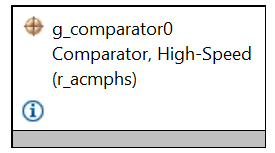
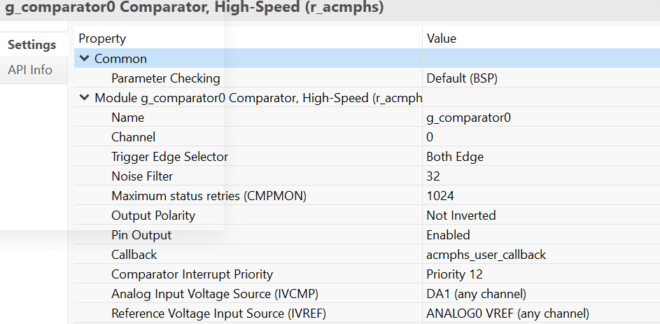
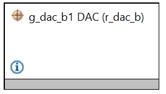
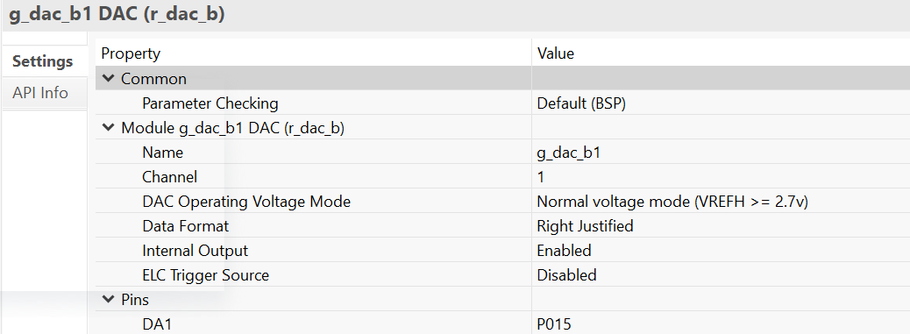
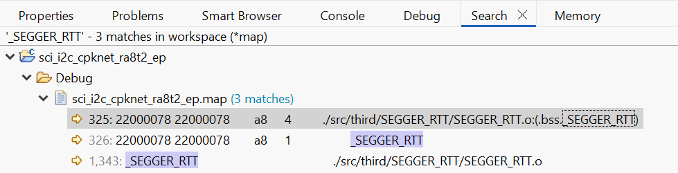

## 1.参考例程概述
该示例项目演示了基于瑞萨 FSP 的瑞萨 RA MCU 上 ACMPHS 驱动程序的基本功能。
### 1.1 创建新工程
如需了解工程的详细创建及配置流程，请参考工程：perf_counter_cpknet_ra8t2_ep

### 1.2 添加比较器外设：Stack中添加“Analog - Comparator,High-speed(r_acmphs) ”.

#### 1.2.1 r_acmphs 属性配置.

### 1.3 添加DAC外设：Stack中添加“Analog - DAC(r_dac_b) ”.

#### 1.3.1 r_acmphs 属性配置.

### 1.4 Debug 模式测试
#### 1.4.1 工程切换为debug模式，编译工程。

#### 1.4.2 查看map文件，搜索_SEGGER_RTT 地址，重新编译后，该地址可能会改变。

#### 1.4.3 debug时，打开J-Link RTT Viewer 输入_SEGGER_RTT 地址

#### 1.4.4 进入仿真界面，J-Link RTT Viewer 观察log输出。

### 1.5 Release 模式测试
#### 1.5.1 工程切换为Release模式，编译工程。
#### 1.5.2 打开PuTTY 设置对应串口，波特率2000000。
#### 1.5.3 用Renesas Flash Programmer下载release文件夹下生成的代码，PuTTY中观察log输出。

## 2. 支持的电路板：
CPKNET-RA8T2
## 3. 硬件要求：
1块瑞萨 RA核心板：CPKNET-RA8T2 + 底板 CPKEXP-ECSMCB

1根Type-C USB 数据线

## 4. 硬件连接：
通过Type-C USB 数据线将 CPKNET-RA8T2 USB 调试端口（JDBG）连接到主机 PC。

## 5. 使用Renesas Flash Programmer V3.21以上版本进行烧录。

