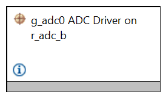
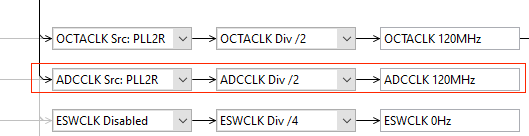
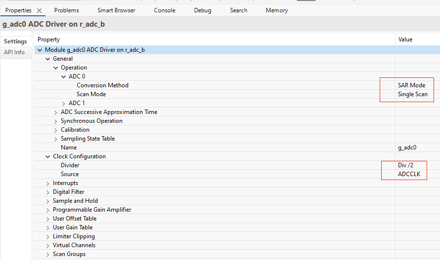
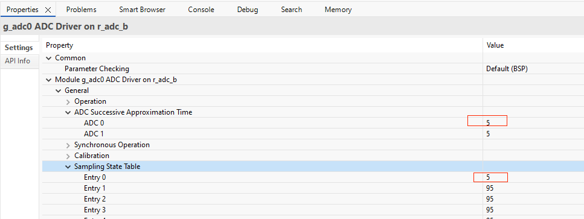
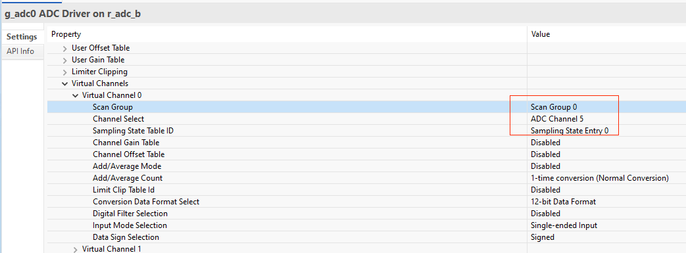
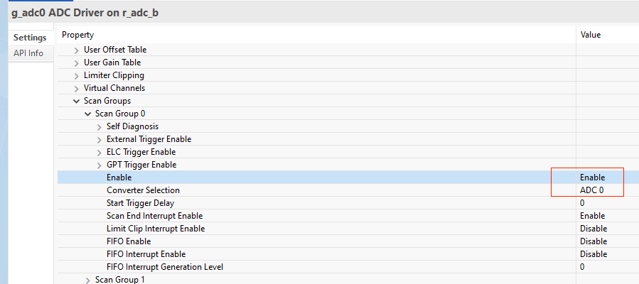
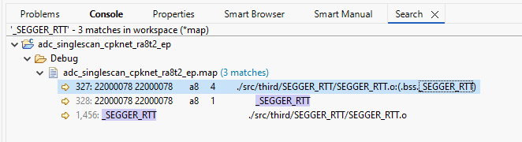
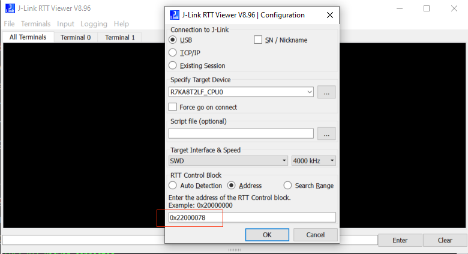

## 1.参考例程概述
该示例项目演示了基于瑞萨 FSP 的瑞萨 RA MCU 上 ADC16H: single scan mode 驱动程序的基本功能.

### 1.1 创建新工程
如需了解工程的详细创建及配置流程，请参考工程：perf_counter_cpknet_ra8t2_ep

### 1.2 Stack中添加“ADC Driver on r_adc_b”.

#### 1.2.0 ADC引脚配置,选择AN005.

#### 1.2.1 ADC 时钟选择PLL2R , 二分频，120MHZ.

#### 1.2.2 ADC 属性配置 ADC0 SAR single scan mode，ADCCLK, DIV/2.

#### 1.2.3 ADC 属性配置 ADC0逐次逼近时间为5，采样时间5.

#### 1.2.4 ADC 属性配置 虚拟通道0选择scan group0，ADC channel 5.

#### 1.2.5 ADC 属性配置 scan group0 使能，选择ADC0.

### 1.3 ADC 测试，具体操作
#### 1.3.1 ADC clock ：60MHZ,ADC channel 5, SAR mode, 12bit single scan mode。
#### 1.3.2 记录 10000次 ADC 转换的时间ns，除以10000000得到的单次转换时间us。
### 1.4 Debug 模式测试
#### 1.4.1 工程设置为debug模式，编译工程。

#### 1.4.2 查看map文件，搜索_SEGGER_RTT 地址，重新编译后，该地址可能会改变。

#### 1.4.3 debug时，打开J-Link RTT Viewer 输入_SEGGER_RTT 地址

#### 1.4.4 进入仿真界面，J-Link RTT Viewer 观察log输出。

可以看到ADC total cycle count: 6668102，则ADC单次转换时间为0.6668us.
### 1.5 Release 模式测试
#### 1.5.1 工程设置为Release模式，编译工程。

#### 1.5.2 打开PuTTY 设置对应串口，波特率2000000。

#### 1.5.3 用Renesas Flash Programmer下载release文件夹下生成的代码，观察log输出。

ADC 总周期数: 6500128， 则ADC单次转换时间为0.65us.
## 2. 支持的电路板：
CPKNET-RA8T2
## 3. 硬件要求：
1块瑞萨 RA核心板：CPKNET-RA8T2 + 底板 CPKEXP-ECSMCB

1根Type-C USB 数据线

## 4. 硬件连接：
通过Type-C USB 数据线将 CPKNET-RA8T2 USB 调试端口（JDBG）连接到主机 PC。

## 5. 使用Renesas Flash Programmer V3.21以上版本进行烧录。

