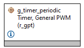
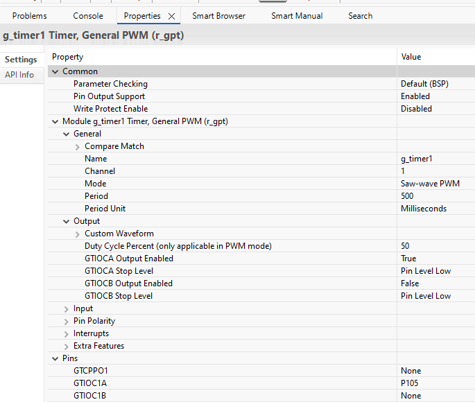
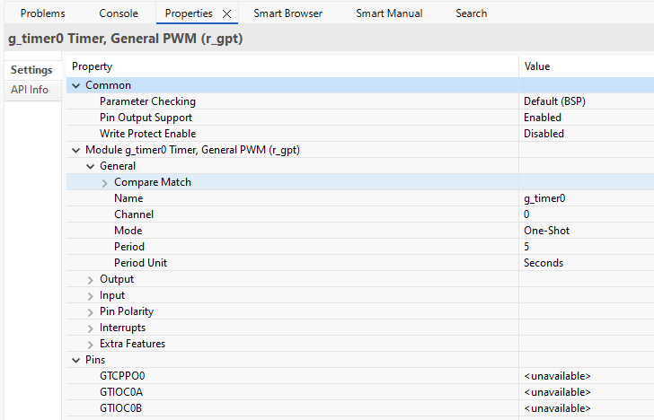
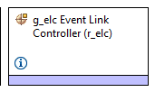
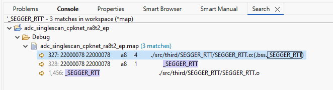
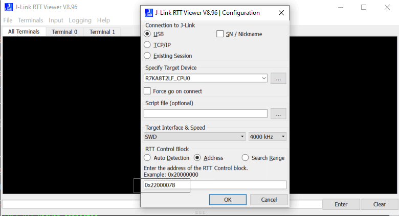

## 1.参考例程概述
该示例项目演示了基于瑞萨 FSP 的瑞萨 RA MCU 上 ELC 驱动程序的基本功能。

### 1.1 创建新工程
如需了解工程的详细创建及配置流程，请参考工程：perf_counter_cpknet_ra8t2_ep

### 1.2 Stack中添加“Timers on r_gpt”.

#### 1.2.1 gpt 引脚配置.

#### 1.2.2 gpt 属性配置,选择GPT1, Saw_wave PWM mode.

#### 1.2.3 New Stack中添加“Timers on r_gpt”.,选择GPT0, one-shot mode.

#### 1.2.4 GPT0 GPT1 的启动源选择：
Input|Start Source|ELC SOFTWARE EVENT 0 (Software event 0)	☑ 
#### 1.2.5 GPT0 GPT1 的停止源选择：
Input|Stop Source|GPT0 COUNTER OVERFLOW (Overflow)	☑

### 1.3 Stack中添加“Event Link Controller（r_elc）”.

### 1.4 Debug 模式测试
#### 1.4.1 工程设置为debug模式，编译工程。

#### 1.4.2 查看map文件，搜索_SEGGER_RTT 地址，重新编译后，该地址可能会改变。

#### 1.4.3 debug时，打开J-Link RTT Viewer 输入_SEGGER_RTT 地址

#### 1.4.4 进入仿真界面，J-Link RTT Viewer 观察log输出。

### 1.5 Release 模式测试
#### 1.5.1 工程设置为Release模式，编译工程。

#### 1.5.2 打开PuTTY 设置对应串口，波特率2000000。

#### 1.5.3 用Renesas Flash Programmer下载release文件夹下生成的代码，观察log输出。

