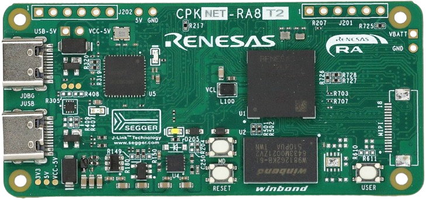

:scripts: cjk

== CPKNET-RA8T2核心板

本目录下仅存放可以在 CPKNET-RA8T2 核心板上直接运行的的样例代码和该核心板的link:../cpknet_ra8t2/docs/01_overview.adoc[使用手册]。

如果您需要查看RA8T2在缺省扩展板上运行的样例代码及文档，请参考 link:../cpk_ra8t2/[CPK-RA8T2]。

如果您需要使用本核心板配合其他扩展板，请参考本代码仓库下对应的目录（cpknet_ra8t2_扩展板名称）。

每个样例程序目录下都准备了对应压缩包供下载，如果您没有同步代码库的需求，可以直接下载ZIP包使用。

样例程序所需的软硬件配置请查看对应样例程序目录下的Readme文件。

样例程序主要分为三大类别

=== A. 在CPKNET-RA8T2上开发的样例程序，可以直接运行

. link:../cpknet_ra8t2/perf_counter_cpknet_ra8t2_ep/[在CPKNET-RA8T2上使用 perf_counter 进行性能测试]
. link:../cpknet_ra8t2/memconfig_benchmark_cpknet_ra8t2_ep/[RA8T2程序/数据存储位置对性能的影响评测样例]

=== B. 在其他CPK上开发的样例程序，仅使用了RA8P1/T2（以及RA8D2/M2） MCU的基础功能和片内外设。

这些样例程序仅需要最小系统（电源，时钟）即可运行，重新选择CPK的BSP后，可以在任何CPK开发板上运行

==== 01 - 基于CPKNET-RA8T2核心板开发的样例程序

. link:../cpknet_ra8t2/adc_continues_scan_cpknet_ra8t2_ep/[RA8T2 MCU上ADC16H（ADC_B）连续扫描驱动程序的基本功能]
. link:../cpknet_ra8t2/adc_singlescan_cpknet_ra8t2_ep/[RA8T2 MCU上ADC16H（ADC_B）单次扫描驱动程序的基本功能]
. link:../cpknet_ra8t2/dac_cpknet_ra8t2_ep/[RA8T2 MCU上DAC12（DAC_B）驱动程序的基本功能]
. link:../cpknet_ra8t2/dma_block_cpknet_ra8t2_ep/[RA8T2 MCU上DMAC驱动程序的基本功能 - 块传输]
. link:../cpknet_ra8t2/dma_normal_cpknet_ra8t2_ep/[RA8T2 MCU上DMAC驱动程序的基本功能]
. link:../cpknet_ra8t2/dma_repeat_cpknet_ra8t2_ep/[RA8T2 MCU上DMAC驱动程序的基本功能 - 重复模式]
. link:../cpknet_ra8t2/dma_repeatblock_cpknet_ra8t2_ep/[RA8T2 MCU上DMAC驱动程序的基本功能 - 重复模式块传输]
. link:../cpknet_ra8t2/elc_cpknet_ra8t2_ep/[RA8T2 MCU上ELC驱动程序的基本功能]
. link:../cpknet_ra8t2/gpt_capture_cpknet_ra8t2_ep/[RA8T2 MCU上GPT驱动程序的基本功能 - 输入捕捉模式]
. link:../cpknet_ra8t2/gpt_cpknet_ra8t2_ep/[RA8T2 MCU上GPT驱动程序的基本功能 - 多种定时器工作模式]
. link:../cpknet_ra8t2/iwdt_cpknet_ra8t2_ep/[RA8T2 MCU上iwdt驱动程序的基本功能]
. link:../cpknet_ra8t2/rtc_cpknet_ra8t2_ep/[RA8T2 MCU上RTC驱动程序的基本功能]
. link:../cpknet_ra8t2/sci_i2c_cpknet_ra8t2_ep/[RA8T2 MCU上SCI-I2C驱动程序的基本功能]
. link:../cpknet_ra8t2/sci_uart_cpknet_ra8t2_ep/[RA8T2 MCU上SCI-UART驱动程序的基本功能]

==== 04 - 基于CPKCOR-RA8T2核心板开发的样例程序

无

==== 03 - 基于CPKHMI-RA8P1核心板开发的样例程序

无

==== 02 - 基于CPKCOR-RA8P1核心板开发的样例程序

无

=== C. 在其他CPK上开发的样例程序，得益于开发板的硬件兼容设计，可以直接（或简单修改后）在CPKNET-RA8T2上运行

==== 04 - 基于CPKCOR-RA8T2核心板开发的样例程序

无

==== 03 - 基于CPKHMI-RA8P1核心板开发的样例程序

无

==== 02 - 基于CPKCOR-RA8P1核心板开发的样例程序

无

Ver. 20260228