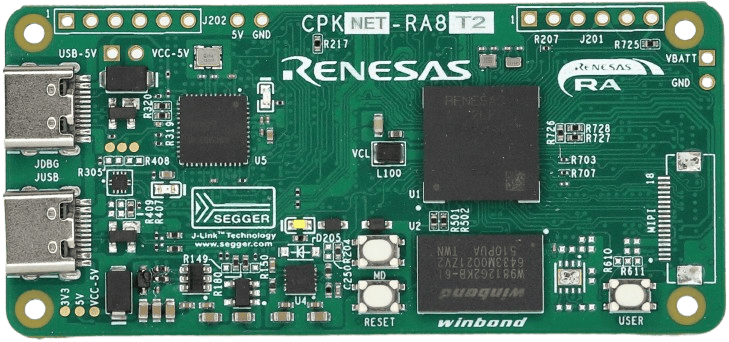

:scripts: cjk

== CPKNET-RA8T2核心板

本目录下仅存放可以在 CPKNET-RA8T2 核心板上直接运行的的样例代码和该核心板的link:../cpknet_ra8t2/docs/01_overview.adoc[使用手册]。

如果您需要查看RA8T2在缺省扩展板上运行的样例代码及文档，请参考 link:../cpk_ra8t2/[CPK-RA8T2]。

如果您需要使用本核心板配合其他扩展板，请参考本代码仓库下对应的目录（cpknet_ra8t2_扩展板名称）。

每个样例程序目录下都准备了对应压缩包供下载，如果您没有同步代码库的需求，可以直接下载ZIP包使用。

样例程序所需的软硬件配置请查看对应样例程序目录下的Readme文件。

. link:../cpknet_ra8t2/perf_counter_cpknet_ra8t2_ep/[基于perf_counter的CoreMark基准测试程序] - link:../cpknet_ra8t2/_ep_archive/perf_counter_cpknet_ra8t2_ep_rafsp6.4.0.zip[下载ZIP包]
. link:../cpknet_ra8t2/memconfig_benchmark_cpknet_ra8t2_ep/[RA8T2在不同的存储配置下使用CoreMark进行性能测试] - link:../cpknet_ra8t2/_ep_archive/memconfig_benchmark_cpknet_ra8t2_ep_rafsp6.4.0.zip[下载ZIP包]
. link:../cpknet_ra8t2/acmphs_cpknet_ra8t2_ep/[RA8P1/x2 MCU的ACMPHS 驱动程序的基本功能] - link:../cpknet_ra8t2/_ep_archive/acmphs_cpknet_ra8t2_ep_rafsp6.5.0.zip[下载ZIP包]
. link:../cpknet_ra8t2/sdram_cpknet_ra8t2_ep/[RA8T2驱动32位SDRAM] - link:../cpknet_ra8t2/_ep_archive/sdram_cpknet_ra8t2_ep_rafsp6.4.0.zip[下载ZIP包]

以下样例程序只与MCU本身相关，或开发板硬件配置一致，修改设置后即可在此核心板上运行：

. link:../cpkhmi_ra8p1/blinky_benchmark_tutorial_cpkhmi_ra8p1_ep/[基于Blinky程序，添加perf_counter和串口通信程序，实现基础程序框架] - link:../cpkhmi_ra8p1/_ep_archive/blinky_benchmark_tutorial_cpkhmi_ra8p1_ep_rafsp6.4.0.zip[下载ZIP包] - CPKHMI-RA8P1 核心板
. link:../cpkhmi_ra8p1/fusb303b_cpkhmi_ra8p1_ep/[RA8P1使用 FUSB303B 识别和控制 USB Type-C的Source 和 Sink 角色] - link:../cpkhmi_ra8p1/_ep_archive/fusb303b_cpkhmi_ra8p1_ep_rafsp6.4.0.zip[下载ZIP包] - CPKHMI-RA8P1 核心板
. link:../cpkhmi_ra8p1/qspi_flash_cpkhmi_ra8p1_ep/[RA8P1驱动QSPI Flash] - link:../cpkhmi_ra8p1/_ep_archive/qspi_flash_cpkhmi_ra8p1_ep_rafsp6.4.0.zip[下载ZIP包] - CPKHMI-RA8P1 核心板
. link:../cpkcor_ra8t2/microsd_basic_rw_cpkcor_ra8t2_ep/[RA8T2对 MicroSD 卡进行无文件系统的基本读写] - link:../cpkcor_ra8t2/_ep_archive/microsd_basic_rw_cpkcor_ra8t2_ep_rafsp6.4.0.zip[下载ZIP包] - CPKCOR-RA8T2 核心板

以下例程使用的硬件配置和系统设置与本核心板类似，可将将这些例程移植到本核心板上运行：

* 无

Ver. 20260817