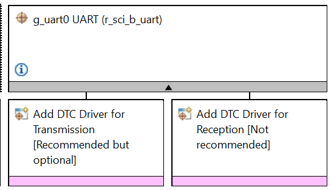
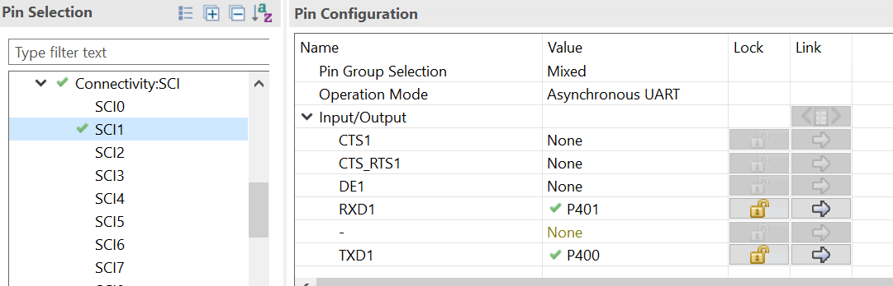
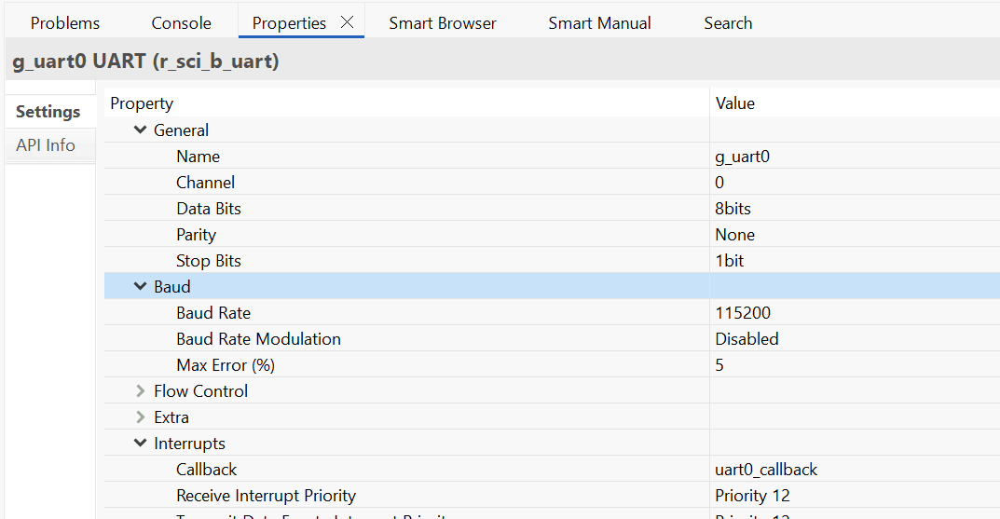
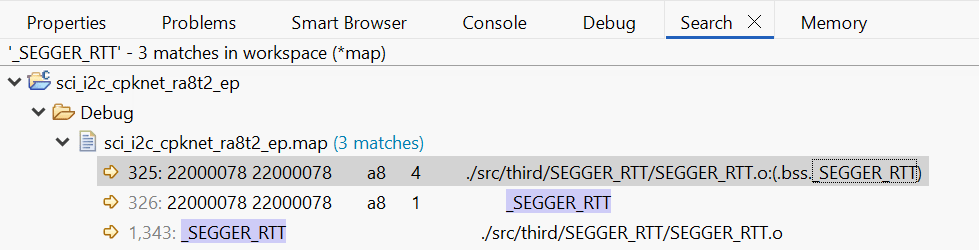
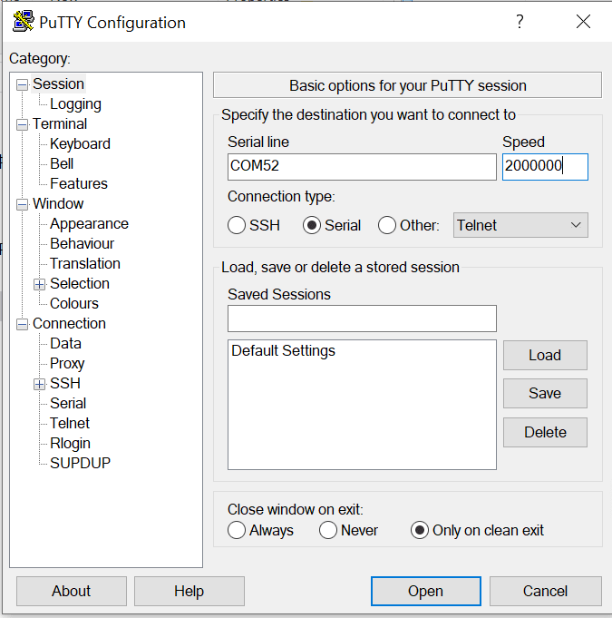

## 1.参考例程概述
该示例项目演示了基于瑞萨 FSP 的瑞萨 RA MCU 上 SCI-UART 驱动程序的基本功能。

### 1.1 创建新工程
如需了解工程的详细创建及配置流程，请参考工程：perf_counter_cpknet_ra8t2_ep

### 1.2 Stack中添加“Connectivity on r_sci_b_uart”.

#### 1.2.1 sci-uart 引脚配置 选择asynchronous UART.

#### 1.2.2 sci-uart 属性配置，配置为g_uart0.

设置波特率115200

### 1.3 Stack中添加“Connectivity on r_sci_b_uart”.
同1.2，添加g_uart1，波特率设置2M，添加g_uart2，波特率设置5M，SCI0 三个配置，分别测试三个波特率的通讯。

### 1.4 uart 测试，具体操作
#### 1.4.1 SCI1 配置为 Asynchronous UART。
#### 1.4.2 SCI1 used as UART1,RXD0=P401[J201:3], TXD1 =P400[J201:24]。
#### 1.4.3 连接 P400 和 P401。调用不同的配置，测试不同波特率下的通讯。

### 1.5 Debug 模式测试
#### 1.5.1 工程切换为debug模式，编译工程。

#### 1.5.2 查看map文件，搜索_SEGGER_RTT 地址，重新编译后，该地址可能会改变。

#### 1.5.3 debug时，打开J-Link RTT Viewer 输入_SEGGER_RTT 地址

#### 1.5.4 进入仿真界面，J-Link RTT Viewer 观察log输出。

### 1.6 Release 模式测试
#### 1.6.1 工程切换为Release模式，编译工程。

#### 1.6.2 打开PuTTY 设置对应串口，波特率2000000。

#### 1.6.3 用Renesas Flash Programmer下载release文件夹下生成的代码，观察log输出。

