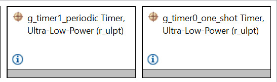
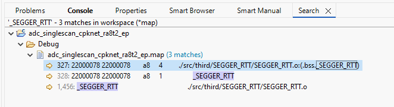
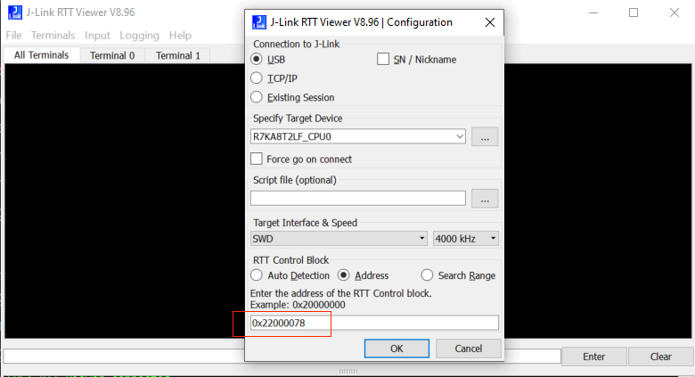

## 1.参考例程概述
该示例项目演示了基于瑞萨 FSP 的瑞萨 RA MCU 上 ULPT 驱动程序的基本功能。
  分别测试了ULPT的Periodic, one-shot 模式。
### 1.1 创建新工程
如需了解工程的详细创建及配置流程，请参考工程：perf_counter_cpknet_ra8t2_ep

### 1.2 Stack中添加两个“Timers on r_agt”.

#### 1.2.1 ulpt channel 0, 设置one-shot模式.
#### 1.2.2 ulpt channel 1, 设置periodic模式.

详细配置参考FSP配置

### 1.3 Debug 模式测试
#### 1.3.1 工程设置为debug模式，编译工程。

#### 1.3.2 查看map文件，搜索_SEGGER_RTT 地址，重新编译后，该地址可能会改变。

#### 1.3.3 debug时，打开J-Link RTT Viewer 输入_SEGGER_RTT 地址

#### 1.3.4 进入仿真界面，J-Link RTT Viewer 观察log输出。

### 1.4 Release 模式测试
#### 1.4.1 工程设置为Release模式，编译工程。

#### 1.4.2 打开PuTTY 设置对应串口，波特率2000000。
#### 1.4.3 用Renesas Flash Programmer下载release文件夹下生成的代码，观察log输出。

